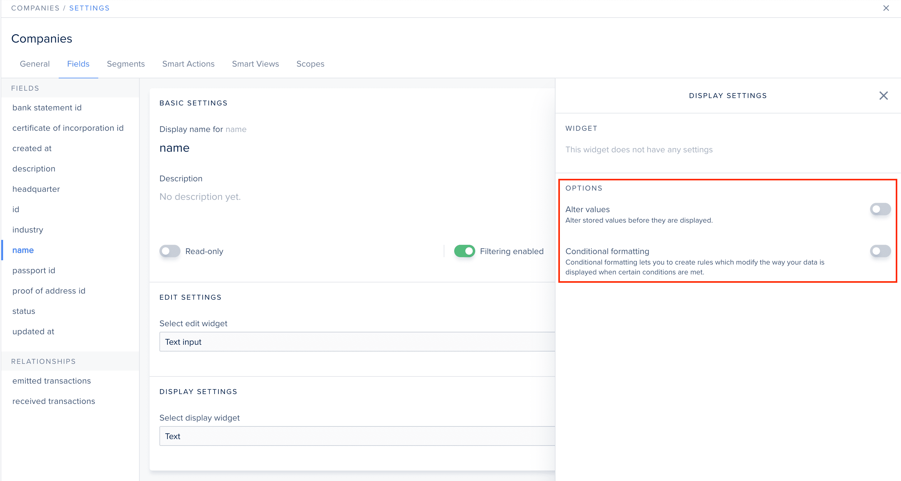
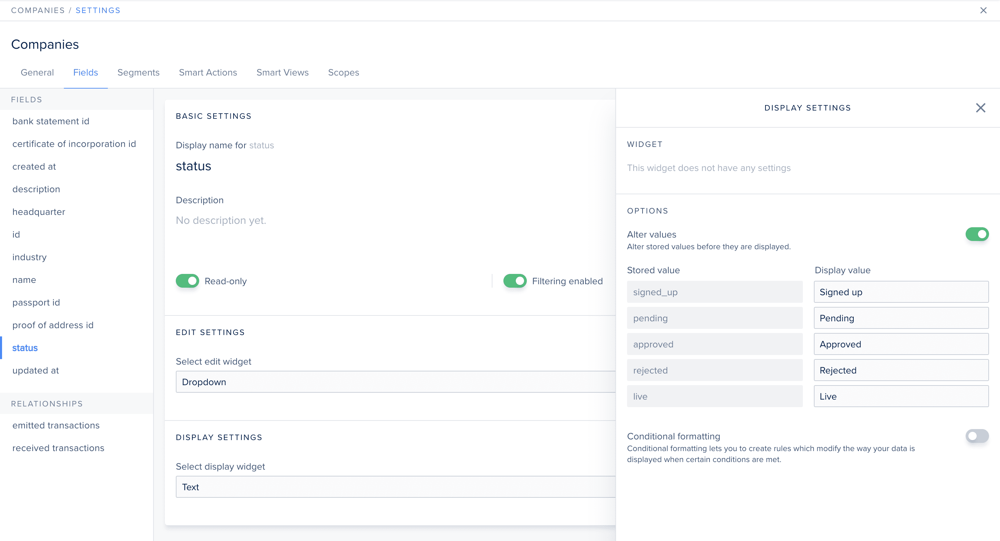

# Options

Options are adjustments that can be made on top of your selected widget settings.


Options apply right before the value is displayed, that's why they are **only available in the display settings** panel.


There are 2 options. Some are available only on specific widgets.

## Alter values

This option allows you modify values fetched from your database before they are displayed on your screen.

This options is best suited for `enum` type fields (since there is a finite number of possible values), but can also be useful for other type fields in specific situations.

## Conditional formatting

This option helps you customize your data's appearance to optimize your users' efficiency dealing with it.

### Auto

This is only available for `enum` type fields. It sets a **random colored badge** for each separate value.

.png>)

This is a possible outcome:

.png>)

### Custom

The "Custom" setup allows you to set **conditional rules** to control how your data is displayed.

#### Add a rule

To add a new rule, click "+ Add a rule" at the bottom. Next, you need to define your condition. Note that condition operators depend on the selected field type.


If 2 conditions are satisfied, only the top one will be applied.


.png>)

It's then up to you to customize how you want the data to be displayed. Change the color by clicking on the colored square. Use the _Sample_ for a quick peak at what the outcome will be.

#### Add a default rule

You may also add a default rule, which will apply if no other condition is met:

 (1).png>)
