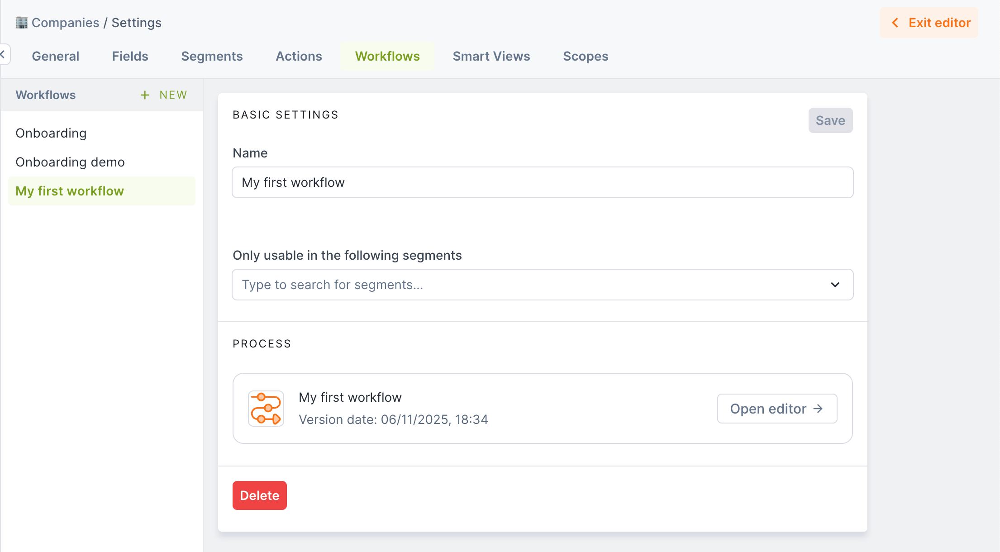

# Workflows

Forest Admin Workflows let you formalize your operational processes in our no-code editor, leveraging your data, actions, and 3rd party apps to ensure reliable, secure, and efficient executions, right in your back office.



## Creating & Managing Workflows

Like all UI customization features in Forest Admin, Workflows can be created and managed by users with the Admin, Developer, or Editor permission level.

### Getting Started

The quickest way to create a new workflow is through our Customization Center (Edit Layout > + Add New).



Alternatively, you can add a new Workflow directly from your Collection Settings, using the "+ NEW" button in the Workflows tab.

### The Workflow Editor

This is where you get to define and map your operational process, without worrying about any of the technical aspects.

#### Interface Overview



The Workflow Editor is made up of the following main elements:

The **Toolbar**, on the left, is where you'll find the **Steps** available to build your Workflow.

The **Canvas**, in the center, is where you build the flow of your process.

The **Settings Panel**, on the right, is where you can configure the Step(s) currently selected in the canvas.

The **Header** is mainly where you can **Save** your workflow, after fixing any issues raised in the **Errors Panel**.

#### Steps

A workflow is a series of Steps, some of which are entirely manual, i.e. the end user will simply have to carry out the instruction provided to them, while **AI-powered** steps will provide some extra help to the end user by surfacing the relevant Data or Actions at runtime.

The following Steps are at your disposal to map your process into a Forest Admin Workflow; let's focus first on our native tasks (\* denotes AI-powered tasks):

**Guidance Tasks** provide instructions to the end user on how to complete the step.

**Trigger Action\*** tasks provide the end user with the Action required to complete the step (e.g. "Trigger the Onboard Customer action").

**Get Data\*** tasks retrieve the value of one or multiple fields, display them to the end user, and load them in the workflow context (e.g. "Retrieve the Name, Address, and Email of the customer").

**Update Data\*** tasks provide the end user with a way to Update the value of a field (e.g. "Update the value of the customer's Address").

**Load Related Record\*** tasks let you load a related data, to access its data and actions in subsequent steps (e.g. "Load the Bank Statement related to the Customer, from the Document collection").



**Decision** steps split your workflow into separate branches, based on a condition.

**Go To** steps can loop back to a previous step, jump to another branch, or step into another workflow.

**Groups** let you organize multiple steps into a group, for improved readability.

**End** steps mark the end of a branch, and the completion of a workflow.



**Escalations** let you indicate a point where the workflow run will be placed in an Inbox, so that another user can pick it up where the previous one left off.

**MCP Tasks\*** let the end user perform an action in a 3rd party app, via the corresponding MCP Server.




Find out more about configuring MCP Servers in Forest Admin [here](/broken/pages/9E2sXl1PkDBGQPizgrzA).


To see each Step type in action, head to the [Workflow Execution section](workflows.md#executing-workflows).

#### Step Automation

Our Workflows have been designed to be human-first for reliability and compliance, but it is possible to automate some steps in order to boost your users' execution efficiency.

At the end of each step, the user has to click on the confirmation button ("Done", by default) to move on to the next step. It's possible to skip this confirmation by setting the **Step Completion** toggle to **Automatic**, so the workflow will automatically proceed to the next step upon completion.

By default, on Trigger Action and MCP Tasks, the end user has to explicitly click on Execute. Once you're confident in our AI suggesting the correct tool, you can set the **Execution** toggle to **Automatic**, so that the suggested Action or MCP tool is automatically executed, saving your user an extra click.


Actions featuring a form will still need to be filled out by the end user, for the time being.


Finally, **Decisions** can be made by our AI, assuming it has the required context based on the previous steps, to automatically guide your users through the relevant branch in your process. To enable this, simply set the **Decision maker** toggle to **AI** on a decision step.

### Managing Workflows

Existing workflows can be managed from the relevant Collection settings, in the Workflows tab. From there, you can rename a workflow, restrict its availability to a subset of Segments, and access the Workflow Editor.

<figure><figcaption></figcaption></figure>

By default, Workflows are available when selecting a single record from the List View; you can toggle their visibility and re-order them in the Layout Editor.

<figure><figcaption></figcaption></figure>

Workflows can also be made available in Summary Views and Workspaces.

## Executing Workflows

Workflows can be executed from the List View (on a single record), the Summary or Details view of a record, or from a Workspace.



### AI-powered Steps

The Get Data, Update Data, Trigger Action, and MCP Task steps aim to provide end users with the tools they need to efficiently execute actions in Forest Admin, and 3rd party apps.&#x20;

Any time one of these steps is completed, the workflow context gathers more information, increasing Forest Admin's AI ability to help complete the execution, for example by pre-filling fields when updating data, or composing an email with the relevant information when notifying a customer via a 3rd party app such as Zendesk.

Every AI-Powered step provides a "Handle Manually" option, to enable users to bypass the suggestion if they deem it not relevant, or if it encountered an error. Subsequent steps would however lack the context, potentially impacting the rest of the workflow.

### Saving & Resuming

During the execution, a workflow can be closed at any time, prompting the user to either Save it, or Abort it.

<figure><figcaption></figcaption></figure>

Saved workflows can be picked by another user, after any length of time.

They're resumed automatically when triggered from a record's Summary View or a Workspace, and can be resumed from the "To Continue" section, when accessed from the List or Record View.

<figure><figcaption></figcaption></figure>

### Revising Steps

Workflows help reduce mistakes in complex processes, but errors may still happen! If you need to correct something, you can always go back and revise a completed step.

After completing a step, click the **Revise** button to redo it. Since workflows can branch based on your choices, revising a step will cancel any steps completed after it. This ensures the workflow follows the correct path based on your updated input.

In the screenshot below, the user is revising the "Lookup on Infogreffe" step. The two steps completed after it ("Get Contact email" and "Notify customer") are now cancelled, allowing the workflow to proceed correctly from this point.

<figure><figcaption></figcaption></figure>

## Security & Auditing

As everything in Forest Admin, our workflow feature is built upon our robust Roles & Permissions system. Although anyone can trigger a Workflow, Data and Actions will only be made available to users whose Role allows them to.

Every completed and aborted workflow executions can be found in the workflow list, for a given record, and can be opened in read-only mode to see its execution in more details.

<figure><figcaption></figcaption></figure>

Every interaction within a workflow execution is recorded in your Activity Logs, available in the Reports tab, or through our public API.

<figure><figcaption></figcaption></figure>
