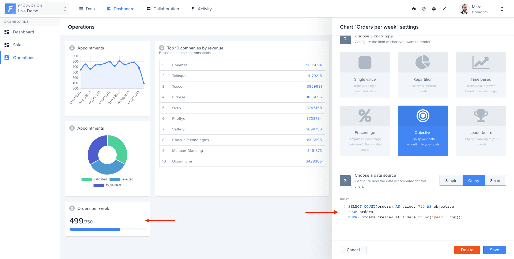

# Create a chart

## Creating a Chart with the UI

Forest Admin provides a straightforward UI to configure the charts you want.

First, turn on the Layout Editor mode **(1)**, then click _Add a new chart_ **(2)**.



To add a new dashboard, click on _+ New_ while in Layout Editor mode **(0)**.


Then add a _Name_ and optionally a _Description_ **(1)** and select a [chart type](./#what-types-of-charts-exist-in-forest-admin) **(2)**:

.png>)

Next, in **Simple** mode, you need to provide the following information, depending on your chart type:

* 1 collection
* 1 aggregate function (`count`, `sum`, …)
* 1 group by field
* 1 time frame (day, week, month, year) option.
* 1 or multiple filters.


## Creating a Chart with SQL


To enable this feature in agent v2, your developers have to add a connection name to the datasources on which you want to execute live queries chart.

After that, you must select on which one you want to run the query.



The **Query** mode is only available for SQL databases.

For **security** reasons, only `SELECT` queries are allowed.


The **Query** mode has been designed to provide you with a flexible, easy to use and accessible interface when hard questions need to be answered. Simply type SQL queries using the online editor and visualize your data graphically.

The syntax of the SQL examples below can be different depending on the database type (SQLite, MySQL, Postgres, SQL Server, etc.). Please, refer to your database documentation for more information.

### Single value

The returned column **must** be named `value`. In the following example, we simply count the number of `customers`.

```sql
SELECT COUNT(*) AS value
FROM customers;
```


### Single value (with growth percentage)

The returned columns **must** be named `value` and `previous`. In the following example, we simply count the number of Appointments booked in January 2018 and compare this value to the number of Appointments booked in the previous month.

```sql
SELECT current.count AS value, previous.count AS previous
FROM (
    SELECT COUNT(*)
    FROM appointments
    WHERE start_date BETWEEN '2018-01-01' AND '2018-02-01'
) as current, (
    SELECT COUNT(*)
    FROM appointments
    WHERE start_date BETWEEN '2017-12-01' AND '2018-01-01'
) as previous;
```


### Repartition

The returned columns **must** be named `key` and `value`. In the following example, we simply count the number of transactions distributed by status.

```sql
SELECT transactions.status AS key, COUNT(*) AS value
FROM transactions
GROUP BY status;
```


### Time-based

The returned columns **must** be named `key` and `value`. In the following example, we simply count the number of `appointments` per month.

```sql
SELECT DATE_TRUNC('month', start_date) AS key, COUNT(*) as value
FROM appointments
GROUP BY key
ORDER BY key;
```

 (1) (1).png>)

### Objective

The returned columns **must** be named `value` and `objective`. In the following example, we set manually the objective to 750.

```sql
SELECT COUNT(orders) AS value, 750 AS objective
FROM orders
WHERE orders.created_at < date_trunc('year', now());
```



### Leaderboard

The returned columns **must** be named `key` and `value` and `LIMIT` **must** be defined. In the following example, we limited the leaderboard to 10 items.

```sql
SELECT companies.name AS key, SUM(transactions.amount) AS value
FROM transactions
JOIN companies ON transactions.beneficiary_company_id = companies.id
GROUP BY key
ORDER BY value DESC
LIMIT 10;
```


