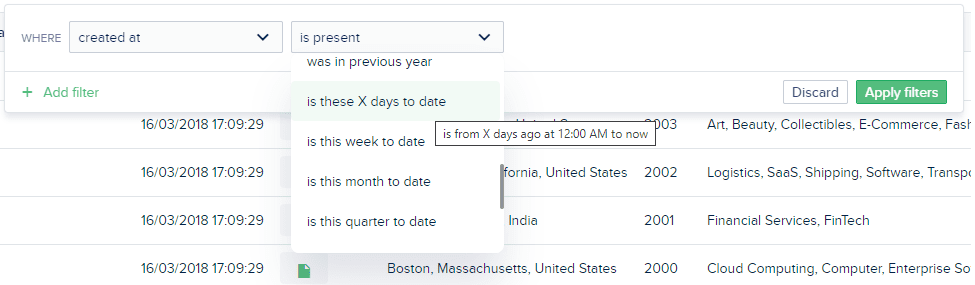

# The Table view

## Search

To search in Forest, use the search bar at the top of the page **(1)**:


Your search terms are highlighted within the matching results **(2)**.


Only regular fields are searched on. All _reference fields_ of `belongsTo` records are ignored, unless you are using an **extended search**.


### Extended search

Lets search for "Lowe":


We get no result!&#x20;


The **extended search** lets you search also within _reference fields_ of `belongsTo` records.

.png>)


_Extended search_ is **not the default** search because it is **slower**.


## Filters

Searching is just one way to be faster at finding the desired data. Forest Admin also allows you to use filters to sort your data.

### Sort your data

By clicking on a column’s header **(1)**, you will sort the data by descending then ascending order, depending on the type of data in this field. An arrow **(2)** will appear in the header, showing you that this column is sorted.


### Add one or several filters


You can filter your list of records by clicking at the very end of the search bar on ‘Filter’ **(1)**. Or you can also  click on the filter icon in column headers as a shortcut to pre-fill the property you wish to filter on **(2)**.&#x20;

If you notice there is no filter **(3)**: either you have [disabled filtering on this field](../../collections/customize-your-fields/#basic-settings), or it is a Smart Field that does not support filters.

Once opened, the filter management dropdown will look like this:

.png>)


The list of filtering options available depends on the nature of the selected field.


To change the logic between conditions, simply click to toggle between AND and OR.


Click **Apply filters** for them to be taken into account.

Once applied, you can save filters as segments (learn more about [segments](../../collections/segments.md#what-is-a-segment)).


**Filtering on related data** is available from version 7.3.0 (4.0.0 for Rails).


### Understanding filters

Most filters are quite straight-forward. Some, however, require a little more explanation:

#### Date filters

There are many date filters which should let you filter exactly on the time period of your choice, but it can get a little confusing. We've added a tooltip which tells you what the directly within the dropdown:




Just **hover** a date filter to see how it would apply right now.


#### "is blank" vs "is present" (Mongodb only)

In NoSQL orms, there is a difference between:


```
{ color: "red", size: "" }
```


and


```
{ color: "red" }
```


Now imagine a third sample:


```
{ color: "blue", size: "M" }
```


Then the following filter conditions will yield the following results:

| Condition(s)                      | Result(s) |
| --------------------------------- | --------- |
| size is blank                     | A and B   |
| size is present                   | A and C   |
| size is present and size is blank | A         |

## Select

The Table view does not only display your data. It also allows you to interact with it:


Forest Admin provides basic CRUD actions out of the box. Check out how you can [duplicate and delete from the Table view](../../collections/actions/#native-actions), but also [create](../../collections/actions/create-a-record.md) and [update](../../collections/actions/edit-a-record.md) from dedicated views.


#### Select all records vs Select current page only

On all table views, you'll notice a down caret (▾) next to the top-left header checkbox. Clicking on it lets you choose between selecting all records of the collection or selection only records from the current page:


Selecting all records has no consequence, however applying an action to all those records might. That's why we've added a warning when you **select all records (1)**:



Having selected all records, you can deselect records from this page only: moving to any another page will deselect all records.


Otherwise, you can **select records from current page only (2)** which will select only visible records:


## Pagination

Navigating the Forest Admin interface is pretty straightforward, and it won’t come as a surprise that our pagination is equally straightforward.

### Browse several pages

Very large collections can’t be displayed on a single page. Where this is the case, you will be able to check the number of records in the collection at the bottom right side of the Table view **(1)**. At the bottom in the middle, you will be able to browse through the different pages of the collection **(2)**.


