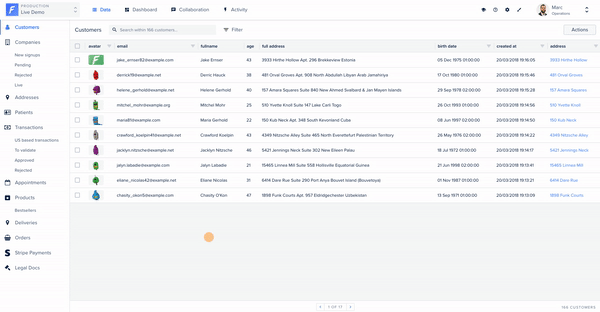

# Using the Layout Editor mode

The Layout Editor mode is your go-to tool when you want to **edit your user interface**.

### Swiching ON the Layout Editor mode ​&#x20;

Provided you have the necessary permission, you will see a paintbrush icon at the **top-right** of your interface.

This switches the Layout Editor mode ON. From this point on, you can edit your layout and collections settings. Read on to discover what you can do.

### Show/hide collections 

Some collections might not be relevant for your operational team. When the Edit mode is ON **(1)**, you will see an _eye_ icon on the left of each collection **(2)**. If this eye is colored, it means that the collection is shown. You can click on it to toggle show/hide a specific collection **(3)**.

### Reorder collections 

When the Edit mode is ON, the editable elements are surrounded by dotted lines **(2)**. If this the case, then you can change the order of the elements by drag-and-dropping them.

### Reorder tabs

After logging in, Forest Admin automatically redirects you to the dashboard by default. It is possible to change the **default tab** for the "Data" tab. To do that:

1. Activate the layout editor
2. Change the position of the "Data" tab &#x20;

