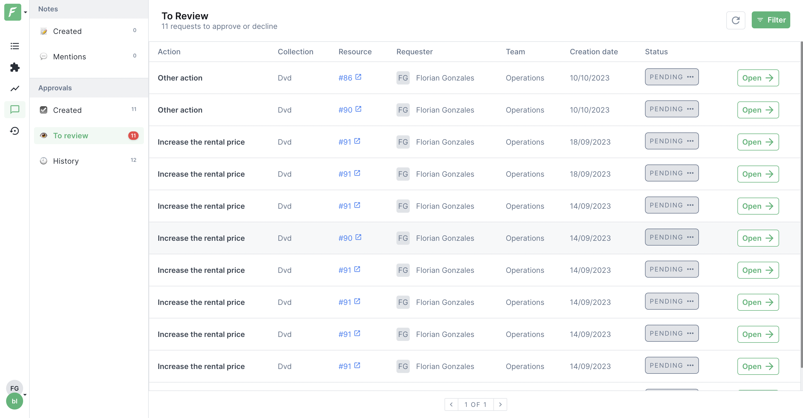
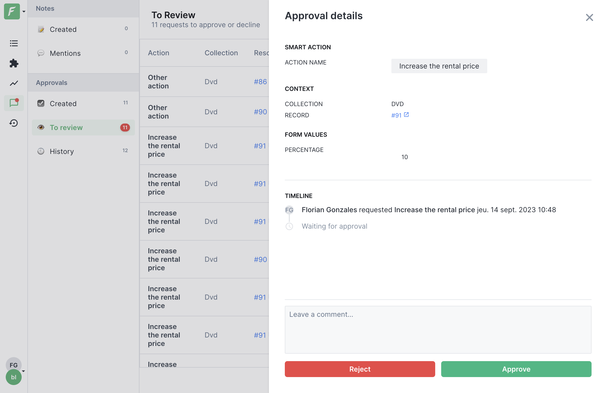
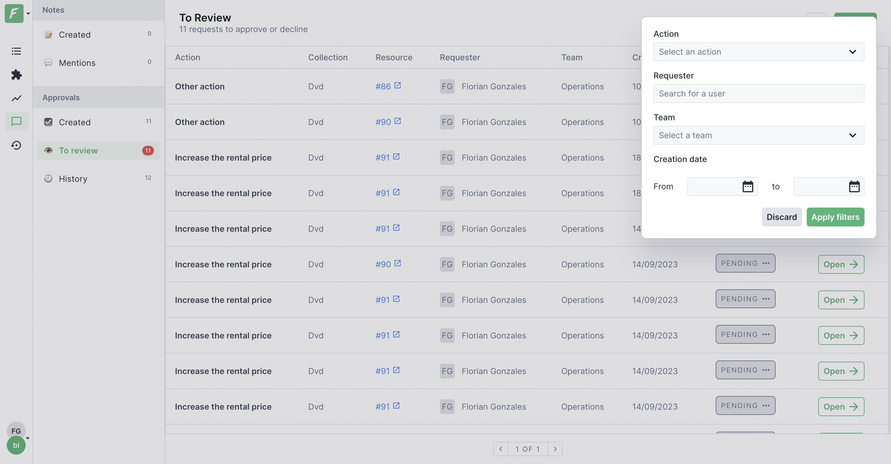
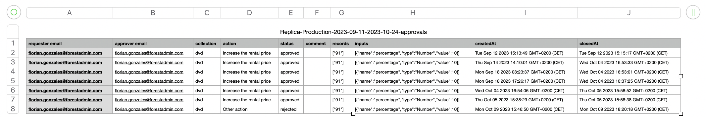

# Approval requests


You must be on a [Forest Admin Pro plan](https://www.forestadmin.com/pricing) to have access to this feature.


Approval requests are created by triggering smart actions that require manual validation to be executed according to the [Approval workflow](../../project-settings/teams-and-users/manage-roles.md#approval-workflow-permissions). On this screen, you will find all approval requests divided into three lists: &#x20;

- __Created__: list of pending approvals you have generated.

- __To review__: list of approval requests that you have the right to approve or reject based on role permission.

- __History__: history of approval requests that have been processed and closed.

## Action on approval requests

By clicking on an approval, a modal will be open. In there you will find the execution context of the action (the targeted record and any form value that was defined on the action). After review, you can either validate or reject the approval:

Once the request has been processed, it will be transferred to the history.

## Filter approvals

The larger your team and your project, the larger the list of approval requests. To manage your actions more easily, you can filter your approvals on different criteria to display a more restricted list.

Available filters are: 
- __Action__: the name of the smart action(s) you wish to display

- __Requester__: the names of the requesters who created the approval requests

- __Team__: the name of the teams associated with approval requests

- __Creation date__: allows you to select an approval request creation date interval

Each of these filters can be combined to give you the most accurate list possible.

## Export approval request history

You can also export the history of your approval requests over a given period. To do this, simply click on the Export button and select the desired time interval in the modal. You'll receive a CSV file by e-mail as soon as possible. 

