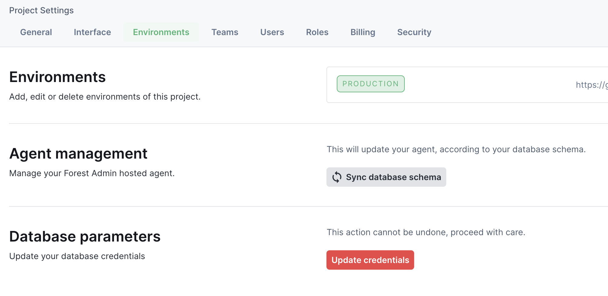

# Environments tab

Environments allow developers to manage [development workflow](https://docs.forestadmin.com/developer-guide-agents-nodejs/deploying-to-production/using-branches).
In cloud version, this tab allow admins and developers to synchronize the agent with the database and to update database credentials.

## Self-hosted version

<figure><figcaption></figcaption></figure>

- [**Development workflow**](https://docs.forestadmin.com/developer-guide-agents-nodejs/deploying-to-production/using-branches)**:** This feature is detailed in the [developer guide](https://docs.forestadmin.com/developer-guide-agents-nodejs/deploying-to-production/development-workflow)

## Cloud version

<figure><figcaption></figcaption></figure>

- **Synchronize database schema:** Fetch the database structure to update collections in your project. Be careful: if you deleted some tables in your database, you will lose all data related to them in forestadmin.
- **Update database credentials:** Allows you to reconnect your database, by providing new credentials. If the new connected database has missing collections, you may force the connection, but you will lose all data related to them in forestadmin.
