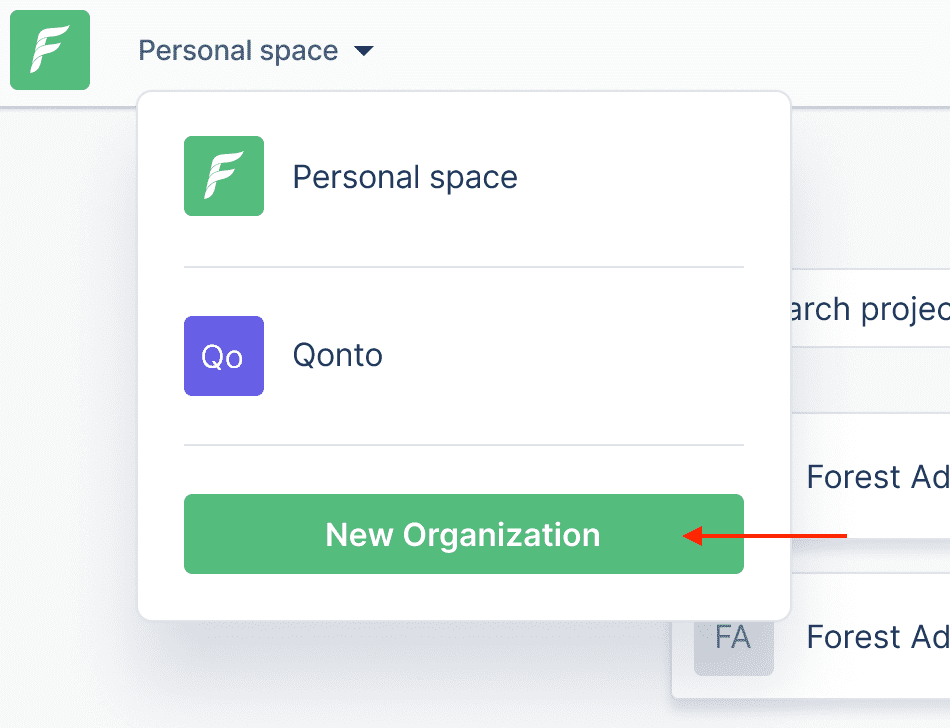

# Organizations

### What is an Organization?

An Organization is simply a **group of projects**: they share the same projects page and some important [settings](organization-settings.md). Organizations are mostly companies that own projects; however you may want to make use of organizations for structuring your projects.

### View your Organizations or create a new one

Once you're logged in, on your projects page, open the top-left dropdown to view your Organizations:

To create a new Organization, click "New Organization". Fill in a name and you're done!

Switch back to the newly-created Organization and start creating a project.

### What is the Personal space

The Personal space is your default space: any project created outside of Organizations will be created here. You can switch to it at any time from the top-left dropdown of your project list page.

 (2).png>)


You may be required to log in again when you switch between Organizations depending of their authentication settings.


### How to log in using Single Sign-On (SSO)

If your Organization has [set up SSO](organization-settings.md#security-tab), this is how you can access it:

then enter the name of your Organization as communicated by your administrator and click "Login":

.png>)
