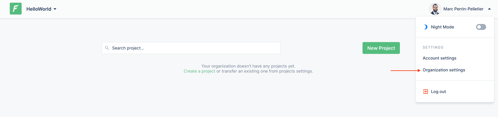
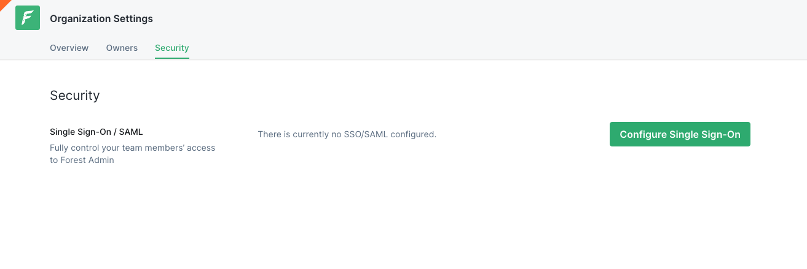
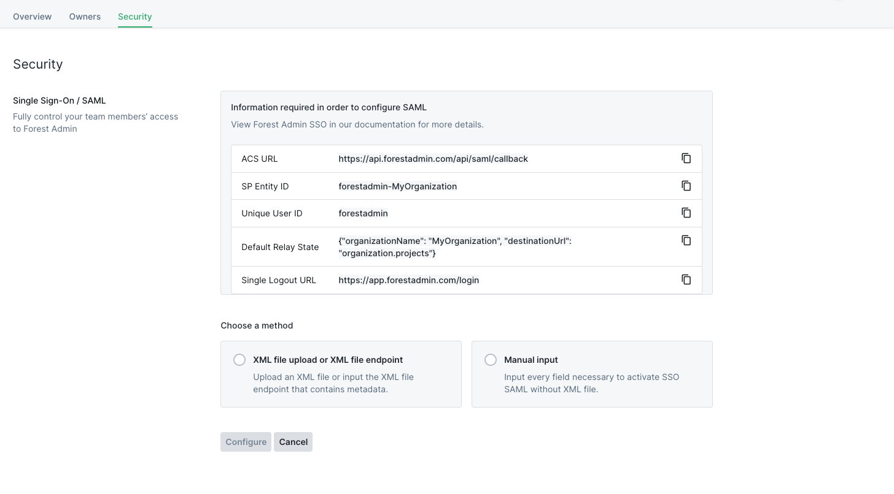

# Organization settings

Your Organization settings are accessible from the top-right dropdown:



### Overview tab

The overview tab gathers the basic settings of your Organization: here you'll be able to edit

* its name
* its logo

or delete it **permanently**.

.png>)

### Owners tab

In this tab you can manage your Organization Owners. Owners are simply users who **have access to the Organization settings**.

 (1).png>)


A user must belong to at least 1 project of the Organization to be invited as an Owner and will be **automatically added as Admin** on all projects of the Organization


### Security tab


You need to be on a [Forest Admin Enterprise plan](https://www.forestadmin.com/pricing) to have access to this feature._You need a least one project within this organization with this plan to gain access to this feature_


This tab gathers all security options of your Organization. For now you can only configure Single Sign-On (SSO).



### Configuring SSO


We are supporting the SAML 2.0 specifications, you can use all the main Identity Providers.

For instance, the following platforms have been tested and documented: [**Okta**](sso-guides/sso-with-okta.md), [**OneLogin**](sso-guides/sso-with-one-login.md), [**Google**](sso-guides/sso-with-google.md), [**Azure Active Directory**](sso-guides/sso-with-azure.md) and [**AWS IAM**](sso-guides/sso-with-aws.md) IdPs.


#### Requirements

To configure SSO for your organization, you must:

* Be an [organization owner](organization-settings.md#owners-tab).
* Have access to your Identity Provider.

#### Configure your Identity Provider

You'll first need to **declare Forest Admin in your Identity Provider** using the information in the grey panel:



| Setting                                         | Description                                                                   | Value                                                                         |
| ----------------------------------------------- | ----------------------------------------------------------------------------- | ----------------------------------------------------------------------------- |
| Callback URL (Assertion Consumer Service URL)\* | Assertion Consumer Service URL is responsible for receiving the SAML response | `https://api.forestadmin.com/api/saml/callback`                               |
| Sign on URL\*                                   | Sign on URL                                                                   | `https://api.forestadmin.com/api/saml/callback`                               |
| Logout URL                                      | Redirected to this location after logout                                      | `https://app.forestadmin.com/login` (⚠️ Or your custom domain if you use one) |
| Audience (EntityID)                             | Named SP Entity ID in Forest Admin                                            | _Value is displayed in the Forest Admin settings_                             |

#### Configure Forest Admin with the Identity Provider Metadata

**XML file upload or XML file endpoint (Recommended)**


We highly recommend to use this option, most especially the one where you provide the metadata file using an url. This allows automatic certificate update without service interruption.


Either upload a file containing the authentication information (you'll be able to generate this file in your Identify Provider) or input the endpoint at which such a file is available (some IPs provide this).

 (1).png>)

**Manual input**

You may also enter your authentication information manually. You'll need to provide:

* a **Login endpoint**
* a **Logout endpoint**
* and finally a **Valid certificate**

.png>)

Click on Test configuration to try to authenticate.

#### Enables it for all the users

If it works, you're all set but you will still need to enable that new SSO authentication method:

.png>)


After enabling SSO, all users will be required to [log in](./#how-to-log-in-using-single-sign-on-sso) again.


#### Identity Provider-initiated login (Optional)

Once you have enabled SSO, you have the option to enable **IdP-initiated login**: this will allow your users to be automatically logged in when they come to Forest Admin from your identity provider dashboard.

.png>)

To set it up properly, you will need to set a default **Relay state** on your identity provider following this format (_or URL encoded depending on the IdP_):

```javascript
{
  "organizationName": "OrganizationName",
  "destinationUrl": "organization.projects"
}
```

#### Troubleshooting

Check the steps below this if you encounter an issue:

* Double check all information (endpoints, certificate expiration dates, etc..)
* Make sure the `NameID` configured on your Identity Provider is the **email address used on Forest Admin accounts too**
* Make sure you selected **SAML 2.0** on your Identity Provider

_If you can't find anything by yourself don't hesitate to_ [_ask for help on our Community forum_](https://community.forestadmin.com/)
