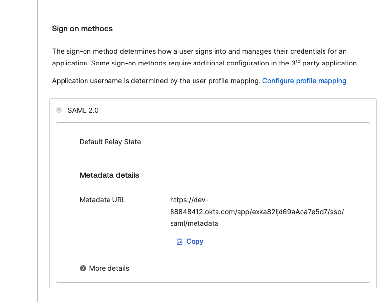
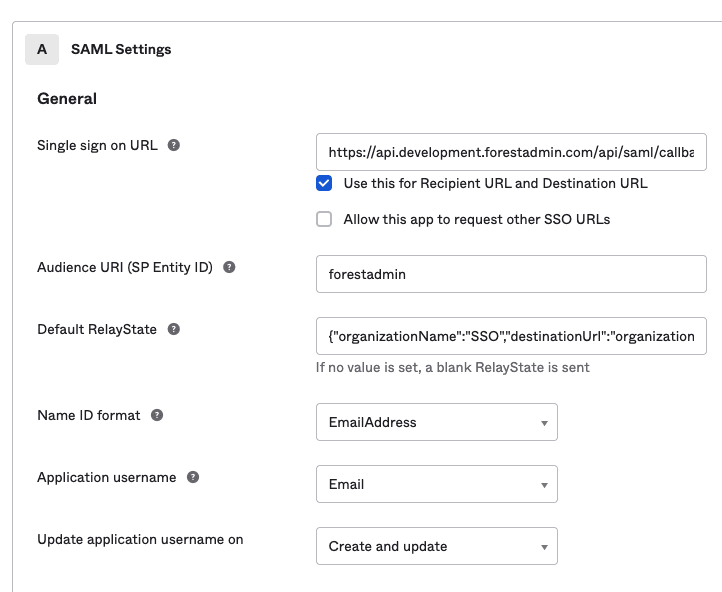

# Okta SSO


You must have one project in your organization with the plan [Forest Admin Pro plan](https://www.forestadmin.com/pricing/) to have access to this feature.


## Requirements

To configure Okta SAML SSO, you must:

- Be in Admin mode in Okta
- Have admin permission level in Forest Admin

## Configuration
1. In your Okta admin dashboard, click **Create a new app integration**
2. Select **SAML 2.0** and follow the wizard.
3. Navigate to the Okta application you just created. Click on the **Sign On** tab, **Metadata details** section. And copy the `Metadata URL` head to Forest Admin, select **XML file upload or XML file endpoint** and paste the `Metadata URL` to the Metadata XML endpoint.
4. Perform some tests and enables it for your whole company.

<figure><figcaption>Okta metadata URL</figcaption></figure>

### IDP-initiated login
You can find more info on [IDP-initiated login here](../organization-settings.md#idp-initiated-login)

<figure><figcaption>RelayState example - Redirect to SSO organization after an IdP initiated login</figcaption></figure>

### Troubleshooting

Follow the below verifications:

* Double check all information (endpoints, certificate expiration dates, etc..)
* Make sure the `nameID` configured on your Identity Provider is the **email address used on Forest Admin accounts**
