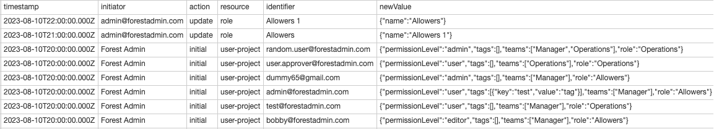

# Export users history


You need to be on a [Forest Admin Pro plan](https://www.forestadmin.com/pricing/) to have access to this feature.


Some organizations with hundreds of collaborators use Forest Admin every day.
Administrators of such projects usually need to monitor how users are added to the admin panel, which Permission Level, Role, Tags they are given or Teams they are assign to by other collaborator authorized to do so.

Such monitoring is possible using the users history export.
You can access to this action in the Users Tab of your Project Settings **(1)**.
Simply click on the Export dropdown **(2)** and select "Export users history" **(3)**.

<figure><figcaption></figcaption></figure>

The configuration changes that are tracked on the users of you project are:&#x20;

- Teams (create / name update / delete)
- Roles (create / name update / delete)
- Users (update)
  - Projects Assignment (i.e. joins or leaves the project)
  - Teams Assignment (i.e. joins or leaves a team)
  - Permission level Assignment
  - Tags Assignment

The export will generate a CSV file.
Each new line materializes a user change and displays the new value for the affected fields listed above.
For example, assigning a user to a new team will log the **complete list of teams** after the new configuration saved.

As a way to display accurate information, the role and teams contained in each entry will be displayed with the name it had at the date of the change.

Here is an example of export content:

<figure><figcaption>
Users history export example
</figcaption></figure>

Let’s detail each column content:&#x20;

- **timestamp**: the exact time the configuration event happened,
- **initiator**: the entity that triggered this event. It can be a project administrator (identified by its email), `Forest Admin` (only used to create an initial state right before we started tracking changes: 2023-08-10) and lastly `Identity Provider` if you implemented the user provisioning via [SCIM](../other-project-settings/security-tab/#user-provisioning-scim).
- **action**: the action `add`, `update` or `remove` triggered on the resource
- **resource**: the targeted resource type, it can be `role`, `team` and `user-project` which represents the user in the context of your project.
- **identifier**: the targeted resource identifier, it is either the name (for `role` and `team`) or the email (for a `user-project`).
- **new value**: the resource state for the monitored values in a JSON format.
