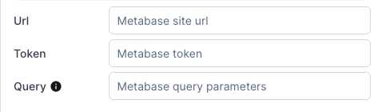

# Building a workspace

Before you can use a workspace, you'll have to build it. To do so, switch to edit mode using the top-right "Edit layout" button.

## Managing components of your workspace

### Adding a component

Components are the bricks of your workspace. To add a component, simply **drag & drop** it from the right-side component menu.

### Renaming a component

Naming your component can help you keep your workspace easy to understand and maintain. Components are given a default name upon creation, but this can be changed from the top-left of the settings panel of your component.

.png>)

### Deleting a component

To delete a component, click on the ellipsis icon at the top-right of the settings panel of your component. In the dropdown, select "Delete component".

.png>)


Deleting a component may impact other components. If this is the case, you'll be warned before proceeding.


## Understanding how components work

### Layout & Guidance components

Components to design your workspace in an intuitive way.

#### Section component

The section component lets you regroup multiple components into a single area.

It enables you to configure the [visibility](./#managing-visibility-of-your-components) for all the components inside only through the Section component.

It also enable you to drag the components inside altogether.

#### Tabs Component

Like the [section component](./#section-component), the tabs components lets you regroup multiple components into a single area, only the active tab components are displayed.

The tabs component can hold between 1 and 10 tabs.

#### Text Component

Write anything you wish to display, then customize how it's displayed using the style options.


You can add [custom style](./#styling-your-components) on this component


#### Link Component

The link component lets you create a link on the workspace. There are 2 modes:

- **Custom**: you can set the url you want, and in this url you can use the value of another component selected record. e.g.: `https://mydomain/posts/{{collection1.selectedRecord.id}}`
- **Redirect to record**: clicking the link will redirect you on the record's detail page.


You can add [custom style](./#styling-your-components) on this component


#### Divider Components

You can use the horizontal and vertical dividers to create a visual separation between components.


You can add [custom style](./#styling-your-components) on this component


### Source components

Components to set the context of your workspace.

#### Search Component

Use the Search component to quickly select a record within a given Collection:

.png>)

With the above settings, you'll be searching within **all fields** of your `Company` records and displaying the [reference field](../../collections/manage-your-collection-settings.md#general-tab).


You can use this component as a source for other components ([Field](./#field-component), [Link](./#link-component), [Text](./#text-component)) or use it in filters.


#### Collection Component

The collection component lets you visualize your data and select records in a workspace.
There are 2 types for the collection component, _Collection_ and _Relationship_.

The _Collection_ type behaves as a regular collection in Forest Admin. You can select records, trigger actions, filter and so on.

The _Relationship_ type lets you visualize your has-many relationships. To make it work, you need to use another workspace component as the source.
Let's say you have a user collection, and one user can have multiple documents.
You can use a search component to search for a user, and use the _Collection Relationship_ component to list all the documents of a selected user.

For the 2 types of collection components, you can do the following (independently from the regular collection settings):

- Add a custom filter on the collection
- Add a custom sorting field and sorting order
- Customize the displayed columns
- Reorder the displayed columns
- Disable the search, or the actions for this component


You can use this component as a source for other components ([Field](./#field-component), [Link](./#link-component), [Text](./#text-component)) or use it in filters.


#### Inbox Component

The inbox component lets your operator treat their [inbox](../../other-tabs/collaboration/distribute-tasks-with-inboxes.md) tasks directly from a workspace.


You can use this component as a source for other components ([Field](./#field-component), [Link](./#link-component), [Text](./#text-component)) or use it in filters.


#### Dropdown Component

The Dropdown is a great UI classic. Here's how you can set it up:

Choose a mode between "Static", "Dynamic > Simple" and "Dynamic > Smart"

##### Static

In _Static_ mode, you hard-code values. You may re-order them using the handles.

<figure><figcaption></figcaption></figure>


_Enable search_ adds a search to your dropdown, making is easier to find values when there are many.


##### Dynamic > Simple

In _Simple_ mode, you choose a collection, a field and optionally a filter: this defines the values that will appear in the dropdown.

.png>)

##### Dynamic > Smart

_Smart_ mode lets you fetch values from an external endpoint.

.png>)

As explained in the tooltip, the expected response format is:

```
{
    "data": [
        "foo",
        "bar"
    ]
}
```

#### Date Picker Component

The date picker component lets your operator choose a date. You can set maximum and / or minimum dates that are enabled.
Minimum and maximum dates can be hardcoded or use [templating](./#making-your-components-interact) to get a date from a selected record.

#### Toggle Component

The toggle component can be used as an input, for example to dynamically filter on a collection or a search component.
It can also be used to display the value of a boolean field.

#### Input Component

The input component is an input, you should use it when you want to dynamically filter a collection or a search component using a text or a number.

### Data & Actions

Components to interact with your data.

#### Action Component

The Action component can be used to trigger `global,` `single`, and `bulk` Smart Actions as well as CRUD operations.&#x20;

<figure><figcaption></figcaption></figure>

If you've selected an action that requires selected record(s) to apply to, then you'll need to specify a source component:

Here we have linked the `action2` component so that when you select a record from the`collection1` component, you'll be able to trigger the _Edit a company_ action in 1 click.&#x20;

#### Field Component

The Field component lets you read data of a record that you selected in a [source](./#source-components) component.

If you have a Collection component in your workspace, make sure its "On row click" option is set to "Select a record": this will allow you to select a record in your table, which in turn feeds the Field component.

.png>)

In the Field component, select `collection1` as the source and choose which field value you wish to display: here we chose `name`.

.png>)

You may have a more complex use case, where you'd want to display a property further away. To achieve this, you'll have to click the _Toggle to input code_ button:

.png>)

For instance, if your collection is `Company` and it is linked to a `Country` collection, you may want to display `{{country.name}}` or even `{{country.headquarter.address}}`.

##### Widgets & labels

Note that you may also choose which [widget](../../collections/customize-your-fields/#list-of-display-widgets) to use to display your field.


The **(Inherited)** widget will use the same widget used in your Collection settings for this field.


Lastly you may also choose whether to display the label and customize it.

### Analytics

Components to visualize your data.

#### Metabase component

All you have to do to embed your Metabase dashboard into Forest Admin workspace is to create a new Metabase component and fill in all necesary informations.



##### Url

This corresponds to the url of your Metabase instance. For example, if your Metabase instance is accessible through https://myanalytics.mycompany.com, then you must set it to the url option.

##### Token

The token is a JWT token and ensures valid authentication when retrieving the Metabase dashboard. The simplest way to do this is to generate it online using https://token.dev. To sign it, you need to use the METABASE_SECRET_KEY provided by Metabase.

You must replace METABASE_DASHBOARD_ID by the correct dashboard ID provided by Metabase.

_JWT Payload_:

```json
{
  "resource": { "dashboard": "<METABASE_DASHBOARD_ID>" },
  "params": {}
}
```

##### Query

Here are the parameters that the dashboard can take into account.
This is a basic query string based input that can interact with workspace context.

For example if your dashboard take `projectId` as parameters, you can put the following as option input.

```
projectId=1
```

or

```
projectId={{searchComponent.selectedRecord.id}}
```

## Making your components interact

Some of your components display data. You may want this data to influence other components. If you've read the [field component](./#the-field-component) section above, you've seen a simple way to make that happen. But there is another way: using **templating**.\
\
**Templating** is pseudo-code that will fetch the piece of data you want from a component. \
To start using it, simply type `{{` in a text input:

.png>)

This opens an autocomplete dropdown which helps you use the correct syntax.

Here are some examples:

<table><thead><tr><th width="340.66545807311365">Templating syntaxe</th><th>Result</th></tr></thead><tbody><tr><td><code>{{collection1.selectedRecord.email}}</code></td><td>Displays the column "email" of the select row of collection1</td></tr><tr><td><code>{{currentUser.fullName}}</code></td><td>Displays the current user's fullname</td></tr><tr><td><code>{{currentUser.email}}</code></td><td>Displays the current user's email</td></tr><tr><td><code>{{currentUser.team}}</code></td><td>Displays the current user's team</td></tr><tr><td><code>{{currentUser.tags.some-tag}}</code></td><td>Displays the current user's value of the tag "some-tag"</td></tr></tbody></table>


If you rename your components, the syntax adjusts automatically in all components using templating.


#### Adding related data

Templating may also be used **in filters** of the Collection component. In practice, this allows you to recreate a related data collection.

.png>)

In the example above, we've set up collection1 (`Customer`) and collection2 (`Order`) so that when you click on a **Customer**, it shows **their Orders only** in collection2.

#### Filtering charts

Templating is also useful within the **Chart** component: you may use other components' data to filter on your chart(s).


This feature is only available from version 9.0.0 for Express/Sequelize and Express/Mongoose and version 1.4.0 for agent-nodejs.\
\
If you're seeing this tooltip, you must upgrade first to benefit from the feature\
.png>)


For instance, if you want to display the number of fast boats belonging to a user, you may use a Collection component in combination with a "Single Value" chart with a filter set up as below:

.png>)

Templating also works within **Query** mode, i.e within your SQL queries, like so:

.png>)

**Bonus**: it's also possible to use templating in the Timeframe property of Time-based charts. This means that you could for instance create a **Dropdown** component with values _Day_, _Week_, _Month_ and _Year_ and using that dropdown would automatically refresh the chart based on the selected timeframe!&#x20;

This is how you would set it up:

.png>)

## Managing visibility of your components

Every component has a `Visible` option - at the bottom of its settings panel - which allows you to control when it is displayed:

<figure><figcaption></figcaption></figure>

The default choice is **Always**, but there are 2 other options that we'll explain shortly:

- Only when a component is visible
- Only when dynamic variables are defined / Only when source record is selected

### Only when a component is visible

This lets you basically select another component and make your component visible when that other component is.&#x20;

A pretty basic example of this is if you want to show dividers only if the component they are splitting the view for is visible.

Similarly, you can make a Section component hidden unless a component inside of it is displayed.

### Only when dynamic variables are defined / Only when source record is selected

As covered in the [Making your components interact](./#making-your-components-interact) section above, components can be set up to depend on information from another component, using **templating**. This visibility option makes it so that the component is visible only if information from the other component it depends on is available.&#x20;

Here's an example:

.png>)

:point*up: This is a Collection component (`collection2`) that is filtered on another Collection component (`collection1`). See how the filter contains \_dynamic variables* (a.k.a templating)? Well, choosing the "Only when dynamic variables are defined" option means `collection2` will appear only if a record of `collection1` is selected.


With the **Always** option, filters containing templating are ignored if undefined.\
\
In practice, this means that in the above screenshot, if Visible was set on Always, `collection2` would ignore its filters unless a record from `collection1` is selected.


## Styling your components

For components with style options, you can change the color, the font, the alignment and the formatting of the displayed text.
