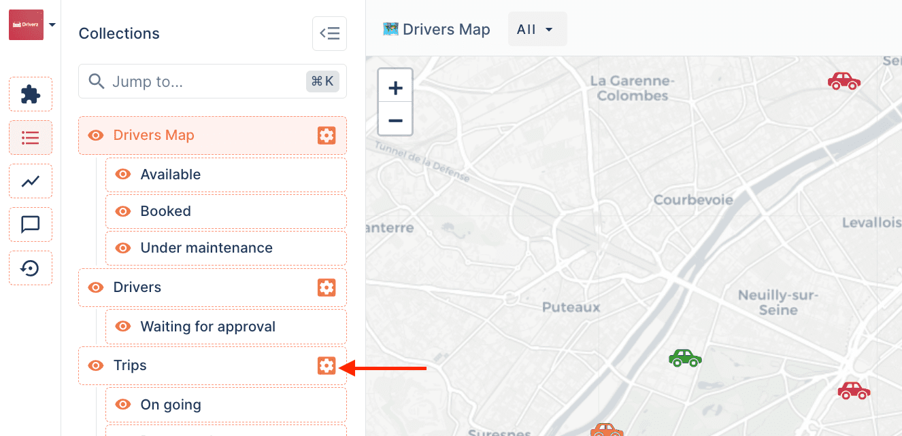
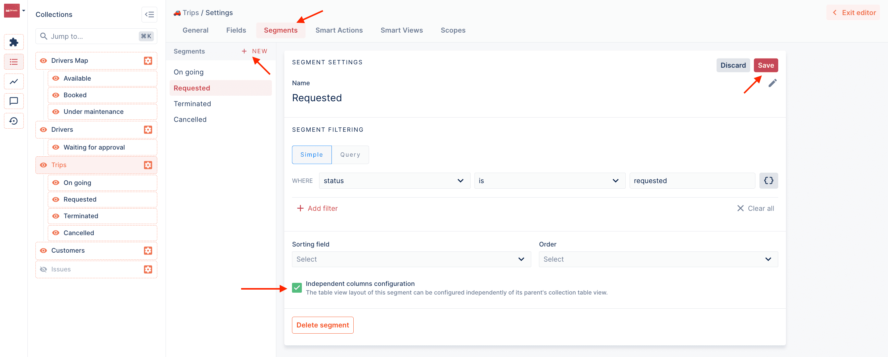
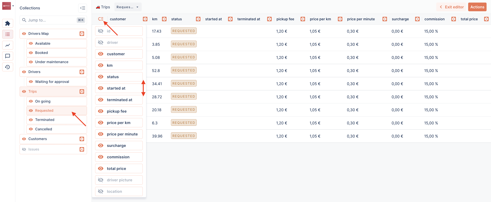
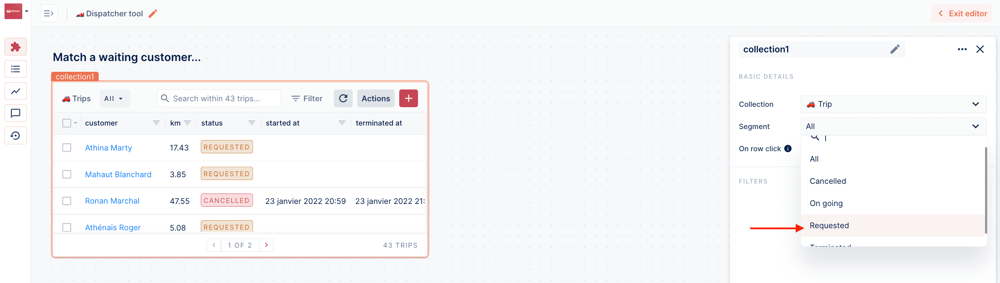
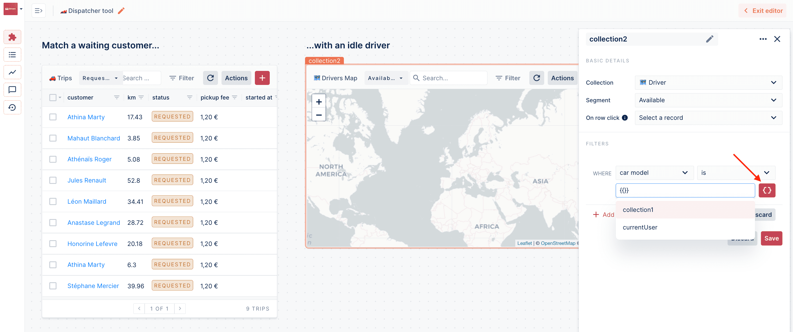
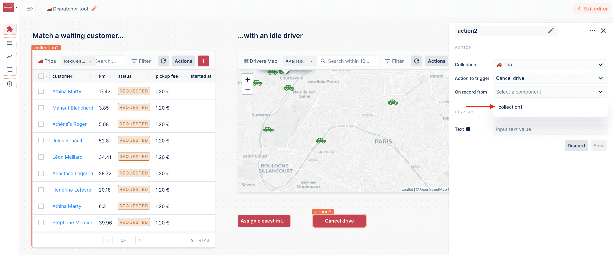

# Fleet Management example

In this guide, we will walk you through the creation of a [workspace](https://app.forestadmin.com/demo-mobility/Production/Operations/workspaces/61b26e10-cc7b-11ec-8d0f-81d554876ead) for the Fleet management use case. Imagine you are an Uber-like company: you manage a fleet of vehicules and must transport customers wherever they ask as fast as possible. The goal of this Workspace is to make this easy to operate from a single screen.

Here's what the workspace will look like:

<figure><figcaption></figcaption></figure>

Once we've created and renamed the workspace, we can add components by drag & dropping them.

<figure><figcaption></figcaption></figure>

For now, there is no way to control the columns displayed in a **Collection** component, but there is a simple way around this: creating a Segment.

To create a segment, go to the corresponding collection's settings:

<figure><figcaption></figcaption></figure>

From the Segment tab, create a new segment, define it and check the "Independent columns configuration" option: this will allow you to organize columns as you wish.

<figure><figcaption></figcaption></figure>

To adjust the columns you want to display and in which order, click the top left icon from the segment view while in Layout Editor mode:

<figure><figcaption></figcaption></figure>

You may now select your segment from the Collection component:

<figure><figcaption></figcaption></figure>

Next, we'll add a map of the idle drivers. This map is a **Smart View** which needs to be coded within the Smart View tab of the corresponding collection settings. If you're interested in such a view, check out [this example](https://docs.forestadmin.com/documentation/reference-guide/smart-views/create-a-map-view).

<figure><figcaption></figcaption></figure>

By selecting the "Available" segment, we're now showing only drivers that are available. But what if we wanted to zoom in on the closest driver to the customer we've selected? Depending on your data, this should be achievable by filtering on the selected customer's data. To do that, use the "Toggle to input code" button and follow the suggestions!

<figure><figcaption></figcaption></figure>

Lastly, let's add actions. In an Action component, if a record must be selected to execute the action on, you'll have to indicate in the "On record from" field what component will be used to select the record. In our case, it will be `collection1`.

<figure><figcaption></figcaption></figure>


Note that actions must be coded by a developer before they can be available in a workspace. It's very simple to [get started with actions](https://docs.forestadmin.com/developer-guide-agents-nodejs/agent-customization/actions).


That's it! We've successfully built a workspace to handle your day-to-day operations as a logistics company!

<figure><figcaption></figcaption></figure>
