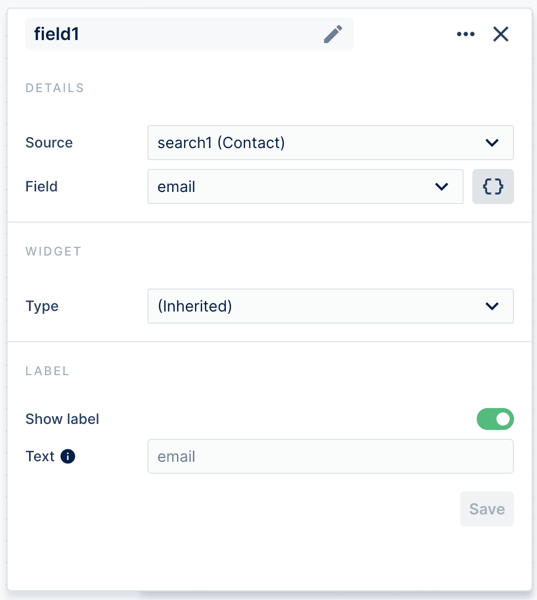
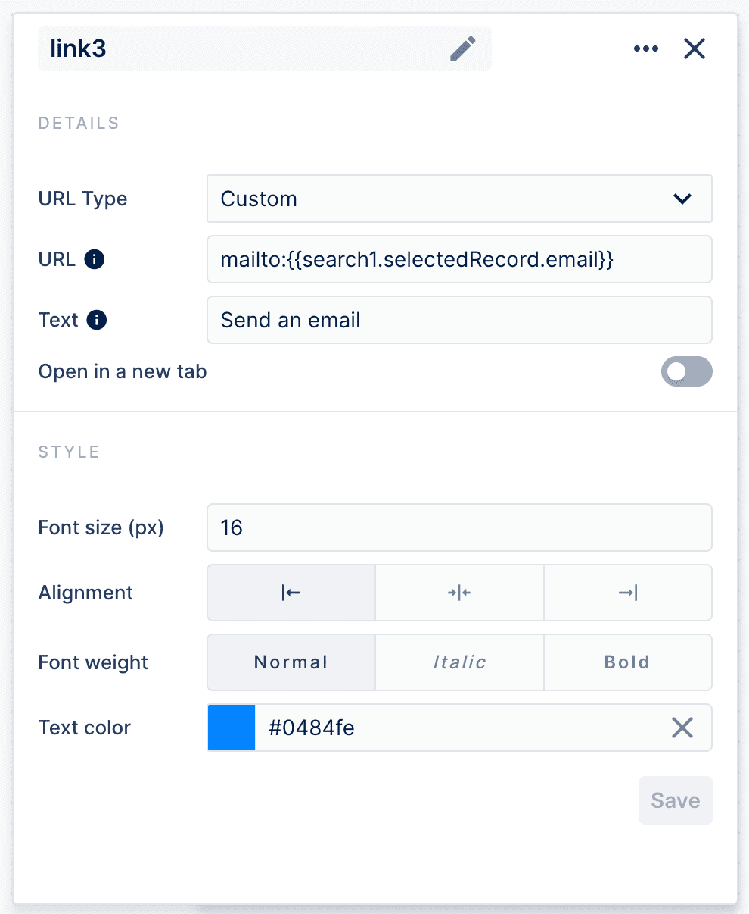
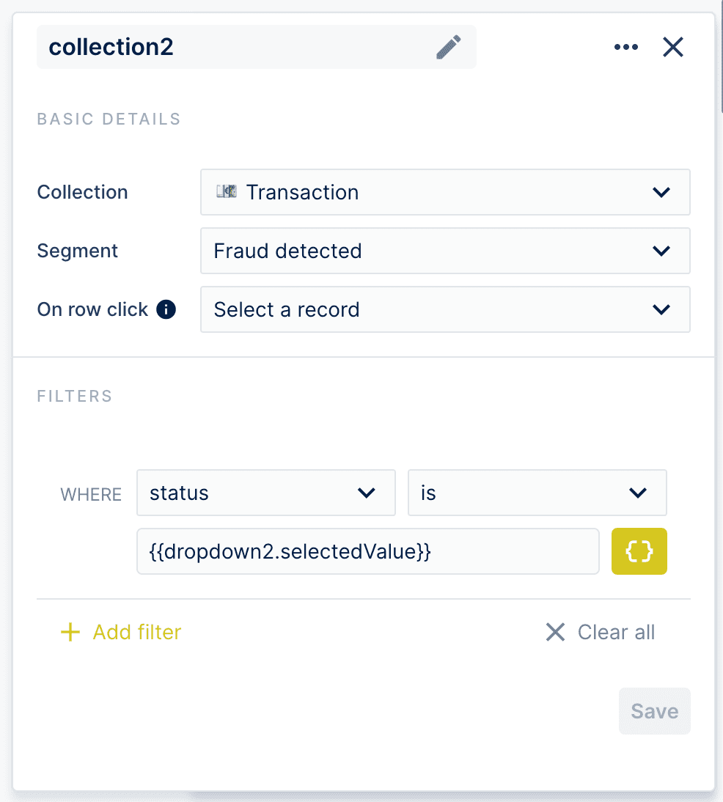

# Transactions Monitoring & Fraud Management example

In this guide, we will walk you through the creation of a workspace for the fraud management use case. The goal of this workspace is to allow users to quickly review all transactions already marked as suspicious, approve or reject them, find a contact information to a relevant person from the company and send them an email to ask for some clarification, all in a single interface. You can find the final workspace in our [Transactions Monitoring and Fraud Management live demo](https://app.forestadmin.com/livedemo/demo-transactions-monitoring/). 

<figure><figcaption></figcaption></figure>

## Create your Workspace

The first step is to create your first workspace. In your Forest Admin project, preferably in your staging environment, click on the 🧩 logo and then "Create your first Workspace"

That's it, you've created your first Workspace! You are now in the Workspace drag-and-drop editor.

You can rename it by clicking the 🖊 icon next to "My Workspace".&#x20;

## Add text to guide your users

To make your Workspace clear and guide your users, you can add Text components. Drag and drop the "Text" component from the right bar to the place you want in your Workspace:

Let's inform users what the workspace is about. You can choose the color, formatting, size of the text and the text component.

Then, make your Workspace more personal leveraging the Templating feature, which allows to add dynamic data into a text component. Just start typing `{{` and you'll see available fields to use. In our case, as we're just starting to build our Workspace, the only data available will be the one from the user interacting with the Workspace.

<figure><figcaption></figcaption></figure>

## Add a chart component

One big advantage of Workspaces is that you can mix various components in a single interface. In our case, we want to give users visibility on the number of suspicious transactions. To do so, drag and drop the [Chart ](https://docs.forestadmin.com/user-guide/dashboards/charts/create-a-chart)component from the side bar:

&#x20;

Then, give your chart a name, decide on the chart type. Here we're going with "Single Value" as we just want display the number of suspicious transaction.&#x20;

Choose the collection for which you want to display data, in our case "Transactions", and select "Count" for the view, as we just want to count the transactions.

Finally, add the relevant filter to display the right data.

.png>)

Done, you now have a graph. You can create another one to add a mini dashboard to your workspace!&#x20;

## Add a collection to allow users to manipulate data

Next, let's jump to the heart of our Workspace, the [Collection ](../../collections/manage-your-collection-settings.md)components that will allow users to see which transactions are marked as suspicious, and approve them, reject, or mark as fraudulent.

To add a collection to your workspace, select the Collection component from the sidebar:

Place it in your Workspace and resize it as you wish. In the sidebar, select which collection you want to display, in our case "Transaction", as well as which [segment](../../collections/segments.md). For this Workspace, we want have a segment of all transactions marked as "Fraud detected".

As we'll see later, we are creating a dynamic Workspace, which reacts to which record you select in your collection. So setup the behaviour "Select a record" when users click on a collection's row! Add a text component describing the collection to guide your users, and you're all done.

 (1).png>)

## Add a button component to allow users to manipulate data from any place in the Workspace

You can also give your users more options and more freedom by letting them perform actions that start with a click of a button.&#x20;

To add a button, drag and drop it from the "Actions" section in the sidebar.&#x20;

​

In this case, we want to allow users to approve a transaction, reject it, or mark it as fraudulent. We're going to use our new collection, and link it with the buttons to make them appear after a user chooses a transaction.

<figure><figcaption></figcaption></figure>

### Add a Search component to allow users to display specific elements they are looking for&#x20;

When linked to a collection, it allows to search for a specific record in order to let users perform actions based on it, either by redirecting them to the record, performing actions with Buttons, or displaying elements linked to the record.&#x20;

For example, we created a Search component to allow users to display contact information in case they need to ask for documents or clarification. We also added a button to allow them to edit this contact in case they notice any outdated information.&#x20;

To add a search component, drag and drop it from the "Actions" section in the sidebar, just like you added a button. &#x20;

​

Then choose the Collection. Your search results will display records saved in this collection. It's worth to add a filter for more relevant search results. In our case, we decided to show only contact information to people from companies with rejected transactions.&#x20;

&#x20;

<figure><figcaption></figcaption></figure>

## Use Field components Templating and Links to make your Workspace actionable

This is how Workspace's magic takes place: make it a dynamic interface for your workflow! We'll display an email address based on search results.&#x20;

### Visualize records' data with the Field document

With the Field component, you can make it easier for your users to check the values of different fields from your collections' records.&#x20;

To add a Field component to your Workspace, drag and drop it from the "Data" section in the sidebar.

Now, configure your Field component. In this Workspace, we want to show the email address of a selected person. So select your search bar as the Field's "source", then pick "email" to show as "Field". You can decide to visualise the data in many ways thanks to the "Type" option, but we will keep the simple email address as a text, so we sticked to the (inherited) type.&#x20;

And that's it! Now when a user will find the right contact in their search box, they will see the email address displayed in the Workspace.

<figure><figcaption></figcaption></figure>

We decided to let them search based on a position to make sure users only contact employees from the right department. It's also possible to search based on a company name, email address, or any other data. However, you can't change it in your workspace. You need to go to the Collection's settings in the Data tab and change the reference field.&#x20;

<figure><figcaption></figcaption></figure>

### Dynamically link to relevant information

Now, use the Link component to allow users to send an email to a chosen contact. Just drag and drop the Link component like you did with a button or a collection, chose "Custom" as a URL type and use a "mailto:" instead of "https://". Start typing \{{ to launch a templating feature to be able to send an email to a record displayed from your previous search.&#x20;

Then you're free to style your link as you wish. &#x20;

<figure><figcaption></figcaption></figure>

And it's done! You have a fully-functional workflow that allows you to send an email to a relevant person. Of course, you can do more with Forest Admin, for example to send such a message without leaving your admin panel. However, you need to create a [smart action](../../collections/actions/create-and-manage-smart-actions.md) first. Workspaces are powerful but they are limited by your database and features of your admin panel.

Now, we'll go back to the first part of our workspace in order to add another link. However, this time, after you added the Link component to your dashboard, select "Redirect to record" as the URL type, and the correct Source, in our case the collection above. The link will then appear with the buttons, after a user clicks on the chosen transaction.

Opening it in a new tab will allow users to check all the details about the transaction separately, without quitting the workspace.

<figure><figcaption></figcaption></figure>

### Contextually display related records with dynamic filters

The Templating feature can also be used to automatically filter a collection based on a record selection in another component.

Let's say that we want to give users an alternative workflow and allow them to filter transactions based on their status.&#x20;

First, let's add a Dropdown component. Simply drag and drop it from the "Actions" section in the sidebar. We decided to do it on the right side of the workspace, to make it clear it's an alternative workflow, designed for users who prefer to work that way.&#x20;

In Content Values, we have manually added each transaction's status we want to appear in the dropdown.

<figure><figcaption></figcaption></figure>

Then, we added a collection that will appear once a user picks a transaction status from the dropdown list. In order to make it possible, you need to add a filter using a templating feature. In our case, it's the status of the transaction based on the previously added dropdown list.&#x20;

<figure><figcaption></figcaption></figure>

Now, it's time to add some buttons that will allow performing actions based on the new collection component. We will add the same buttons as we did before to allow users perform the same actions (approve a transaction, reject it, or mark it as fraudulent), just as a part of a an alternative workflow. However, you have to add a second set of buttons because they will be linked to the new, alternative, collection.

<figure><figcaption></figcaption></figure>

You're almost done! Now add dividers from the Layout and Decoration section to separate different sections of your workspace and make it more clear to the users.&#x20;

&#x20;

Now enjoy your new workspace!&#x20;

<figure><figcaption></figcaption></figure>
