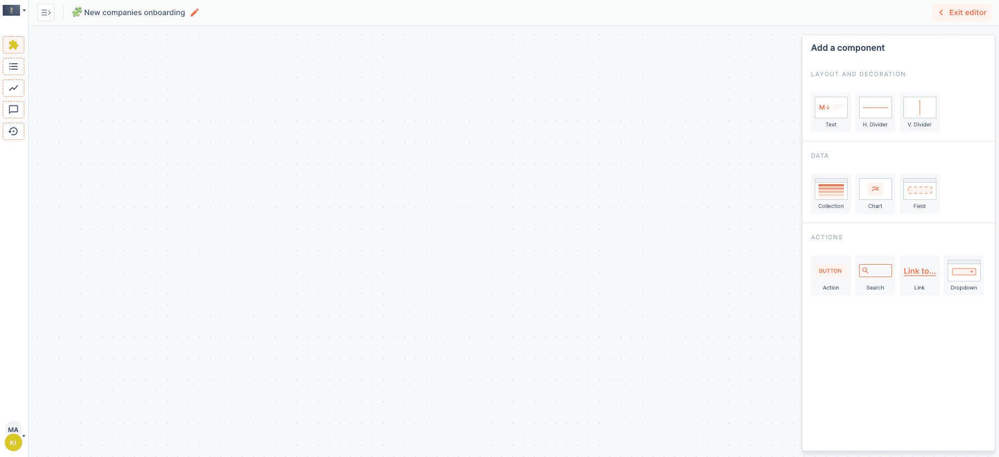
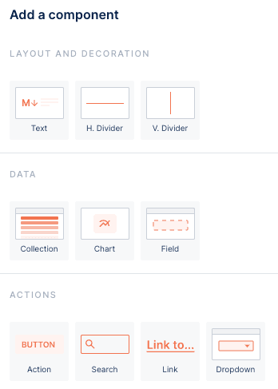
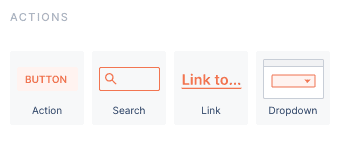
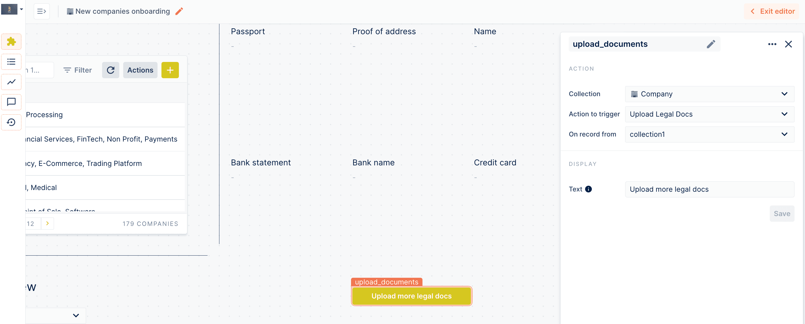
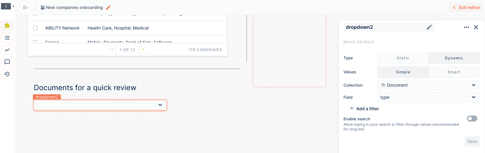

# Workspace KYC example

In this guide, we will walk you through the creation of a workspace for the KYC use case. The goal of this Workspace is to allow users to quickly visualise companies who signed up recently, assess potential missing information and documents, and complete those gaps, in a single interface. You can find the final workspace in our [KYC live demo](https://www.forestadmin.com/usecases/kyc).

<figure><figcaption></figcaption></figure>

## Create your Workspace

The first step is to create your first option. In your Forest Admin project, preferably in your staging environment, click on the 🧩 logo and then "Create your first Workspace"

That's it, you've created your first Workspace! You are now in the Workspace drag-and-drop editor.

You can rename it by clicking the 🖊 icon next to "My Workspace".&#x20;

## Add text to guide your users

To make your Workspace clear and guide your users, you can add Text components. Drag and drop the "Text" component from the right bar to the place you want in your Workspace:

Let's add the title of the workspace for instance. You can choose the color, formatting, size of the text and the text component.

Make your Workspace more personal leveraging the Templating feature, which allows to add dynamic data into a text component. Just start typing `{{` and you'll see available fields to use. In our case, as we're just starting to build our Workspace, the only data available will be the one from the user interacting with the Workspace.

## Add a chart component

One big advantage of Workspaces is that you can mix various components in a single interface. In our case, we want to give users visibility on the number of companies with the "Signed Up" status. To do so, drag and drop the [Chart ](https://docs.forestadmin.com/user-guide/dashboards/charts/create-a-chart)component from the side bar:

Then, give your chart a name, decide on the chart type. Here we're going with "Single Value" as we just want display the number of companies missing documents.&#x20;

Choose the collection for which you want to display data, in our case "Company", and select "Count" for the view, as we just want to count the companies missing documents.

Finally, add the relevant filter to display the right data.

Done, you now have a graph. By the way, you can also leverage the Text component to guide your users into how to use your Workspace!

## Add collection to allow users to manipulate data

Next, let's jump to the heart of our Workspace, the [Collection ](../../collections/manage-your-collection-settings.md)components that will allow users to see which companies are missing which documents, and to upload those missing documents.

To add a collection to your workspace, select the Collection component from the sidebar:

Place it in your Workspace and resize it as you wish. In the sidebar, select which collection you want to display, in our case "Company", as well as which [segment](../../collections/segments.md). For this Workspace, we want have a segment of all companies with the "Signed up" status

As we'll see later, we are creating a dynamic Workspace, which reacts to which record you select in your collection. So setup the behaviour "Select a record" when users click on a collection's row! Add a text component describing the collection to guide your users, and you're all done.

## Use Field components Templating and Links to make your Workspace actionable

This is how Workspace's magic takes place: make it a dynamic interface for your workflow! We'll create a dedicated section in the Workspace using the Vertical Divider and Text components

Note that we're also using the Templating feature here to dynamically display the name of the company we're reviewing.

### Dynamically link to relevant information

Use the Link component to allow users to access all the details of a selected company if necessary.

After you added the Link component to your dashboard, select "Redirect to record" as the URL type, and the correct Source, in our case the select Company. The link will be dynamically updated according to the selecting record.

### Visualize records' data with the Field document

With the Field component, you can make it easier for your users to check the values of different fields from your collections' records with the Field component.&#x20;

To add a Field component to your Workspace, drag and drop it from the "Data" section in the sidebar.

Then make sure the collection from which we will select the records, "Companies" in our case, is setup with "On row click" setting as "Select a record"

Now, configure your Field component. In this Workspace, we want to show the documents of a selected company. So select your "Companies" collection as the Field's "source", then the document you want to show as "Field". Our documents are stored as images, so we will display those images in our workspace. To do this, we use the "File viewer" widget type.

You can customise the size of the image preview and additional parameters, then click "Save" and you're good to go. Repeat those steps for as many different document types you want to display in your workspace.

.png>)

And that's it! Now when a user will click on a row in the "Companies" collection, they will see the company's documents displayed in the Workspace.

### Contextually display related records with dynamic filters

The Templating feature can also be used to automatically filter a collection based on a record selection in another collection.

Let's say that we want to show users all the documents related to a specific company.

On your workspace, add a new collection with a filter. Configure it so it will filter on the company ID of the selected company in our your first collection, by adding `{{collection1.selectedRecord.id}}` in the filter value.

### Add a button component to allow users to manipulate data from any place in the Workspace

You can also give your users more options and more freedom by letting them perform actions that start with a click of a button.&#x20;

To add a button, drag and drop it from the "Actions" section in the sidebar.&#x20;

<figure><figcaption></figcaption></figure>

Let's say we want to allow users to upload more documents. We're going to use the same collection we used when adding the Field components to display the data - Company. Link it with the Collection on the left side of the page ('collection 1') to make the button appear after a user chooses a company, and finally pick 'Upload Legal Docs' as an Action to trigger.&#x20;

<figure><figcaption></figcaption></figure>

### Add a Dropdown component to allow users to display elements from a dropdown list

Dropdown lists are a very popular navigation elements. Now, you can also use them in Forest Admin workspaces. To add a dropdown, drag and drop it from the "Actions" section in the sidebar.

<figure><figcaption></figcaption></figure>

We want to let users to display specific types of documents for a quick review. For example, for privacy reasons, they may need delete every passport stored in the database. In order to do so, we created a Dynamic Dropdown component with Simple values. Then we connected it with the Document collection and chose 'type' as a Field to display.&#x20;

<figure><figcaption></figcaption></figure>

Now we need to display the documents whose type has been chosen in the drop-down list. In order to do so, we have added a new collection below. Apart from linking it to the Document Collection, we have added a filter that links it to the newly created Dropdown component using a Templating feature.&#x20;

<figure><figcaption></figcaption></figure>

The final step is to add one or more buttons to perform specific questions. In this case, we allow users to edit or delete a document.&#x20;

<figure><figcaption></figcaption></figure>

### Add a Search component to allow users to display elements from a dropdown list

The new Search components works in a similar way to the Dropdown. When linked to a collection, it allows to search for a specific record in order to let users perform actions based on it, either by redirecting them to the record or perform actions with Buttons.&#x20;

For example, we created a Search component to allow users to edit or delete a document found using a search box.&#x20;

<figure><figcaption></figcaption></figure>

## Using our new Workspace

We created the perfect Workspace for our documents management workflow. Now let's see how our users are going to use it.

Click on "Exit builder" and you will land on the user facing Workspace.

The collections within Workspace come with the same actions available in the collections within the "Data" tab.

Meaning that for our use case, within the collection component, users can select one company. Let's say "EasySalary". We see the the company is missing Bank statement, Certificate of incorporation and Proof of Address. Once the company is selected, users can perform the "Upload Legal Docs" action. 

I can upload the right documents for EarlySalary

And update its status

And that's it, EarlySalary has now moved to the next steps of the onboarding process, it doesn't appear in my Workspace anymore!&#x20;

Apart from that, users can also perform quick action on documents that belong to any company.&#x20;

<figure><figcaption></figcaption></figure>

Or perform the same action using search box instead of a drop-down list.&#x20;

<figure><figcaption></figcaption></figure>
